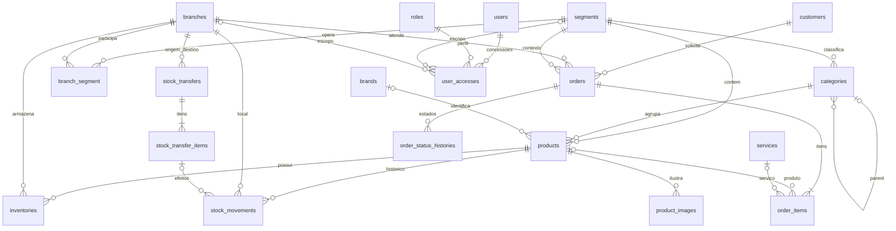

# Modelo de dados e ERD

O [ERD completo em Mermaid](erd.mmd) e o [dicionário estruturado](schema.json) acompanham este documento. As migrations em reference/migrations são o contrato físico de referência para os módulos próprios. Tabelas de autenticação/filas existentes e tabelas geridas por pacotes são descritas abaixo.

## Convenções e integridade

Todas as tabelas próprias têm id bigint unsigned e timestamps UTC; movimentos, histórico de estados e auditoria só têm created_at. Strings têm 255 caracteres, salvo ajustes posteriores fundamentados. Dinheiro decimal(15,2), quantidades decimal(15,3), coordenadas com sete casas. Campos marcados ? admitem NULL. Booleanos de publicação começam false. Não há exclusão em cascata: FKs restringem eliminação para preservar referências. Inativar cadastros utilizados; apagar apenas rascunhos sem dependências através de Action que trate filhos explicitamente.

Regras condicionais (mesmo segmento, exatamente um produto/serviço, saldos não negativos, estados, hierarquia acíclica e escopos válidos) são obrigatórias nas Actions e nos Requests. Não são garantidas apenas pelas migrations de referência. CHECKs adicionais devem ser adicionados quando fixada a versão MySQL/MariaDB e testados nesse motor. Não executar SQL arbitrário fora das Actions com a conta operacional.

## Visão das relações principais

## Dicionário físico dos módulos

### segments — Segment

| Campo | Tipo | Referência |
|---|---|---|
| id | bigint PK | — |
| name | string | — |
| slug | string | — |
| description | text ? | — |
| icon | string ? | — |
| image | string ? | — |
| active | boolean default false | — |
| sort_order | unsignedInteger | — |
| created_at / updated_at | timestamp | UTC |

Unicidade: slug. Índices adicionais: FKs.

### branches — Branch

| Campo | Tipo | Referência |
|---|---|---|
| id | bigint PK | — |
| name | string | — |
| slug | string | — |
| city | string | — |
| province | string | — |
| address | text ? | — |
| phone | string ? | — |
| whatsapp | string ? | — |
| email | string ? | — |
| latitude | latitude ? | — |
| longitude | longitude ? | — |
| opening_hours | json ? | — |
| active | boolean default false | — |
| created_at / updated_at | timestamp | UTC |

Unicidade: slug. Índices adicionais: FKs.

### branch_segment — associação

| Campo | Tipo | Referência |
|---|---|---|
| id | bigint PK | — |
| branch_id | foreignId | branches |
| segment_id | foreignId | segments |
| created_at / updated_at | timestamp | UTC |

Unicidade: branch_id + segment_id. Índices adicionais: FKs.

### user_accesses — UserAccess

| Campo | Tipo | Referência |
|---|---|---|
| id | bigint PK | — |
| user_id | foreignId | users |
| role_id | foreignId | roles |
| segment_id | foreignId ? | segments |
| branch_id | foreignId ? | branches |
| created_at / updated_at | timestamp | UTC |

Unicidade: user_id + role_id + segment_id + branch_id. Índices adicionais: user_id + segment_id + branch_id.

### categories — Category

| Campo | Tipo | Referência |
|---|---|---|
| id | bigint PK | — |
| segment_id | foreignId | segments |
| parent_id | foreignId ? | categories |
| name | string | — |
| slug | string | — |
| description | text ? | — |
| image | string ? | — |
| active | boolean default false | — |
| sort_order | unsignedInteger | — |
| created_at / updated_at | timestamp | UTC |

Unicidade: segment_id + slug. Índices adicionais: FKs.

### brands — Brand

| Campo | Tipo | Referência |
|---|---|---|
| id | bigint PK | — |
| name | string | — |
| slug | string | — |
| image | string ? | — |
| active | boolean default false | — |
| created_at / updated_at | timestamp | UTC |

Unicidade: slug. Índices adicionais: FKs.

### products — Product

| Campo | Tipo | Referência |
|---|---|---|
| id | bigint PK | — |
| segment_id | foreignId | segments |
| category_id | foreignId | categories |
| brand_id | foreignId ? | brands |
| name | string | — |
| slug | string | — |
| sku | string ? | — |
| barcode | string ? | — |
| short_description | text ? | — |
| description | text ? | — |
| price | money ? | — |
| sale_price | money ? | — |
| cost_price | money ? | — |
| unit | string | — |
| purchase_mode | string | — |
| featured | boolean default false | — |
| active | boolean default false | — |
| created_at / updated_at | timestamp | UTC |

Unicidade: slug; sku. Índices adicionais: segment_id + active + featured; category_id + active; name.

### product_images — ProductImage

| Campo | Tipo | Referência |
|---|---|---|
| id | bigint PK | — |
| product_id | foreignId | products |
| disk | string | — |
| path | string | — |
| alt | string ? | — |
| sort_order | unsignedInteger | — |
| created_at / updated_at | timestamp | UTC |

Unicidade: apenas id. Índices adicionais: product_id + sort_order.

### inventories — Inventory

| Campo | Tipo | Referência |
|---|---|---|
| id | bigint PK | — |
| product_id | foreignId | products |
| branch_id | foreignId | branches |
| quantity | decimal | — |
| minimum_quantity | decimal | — |
| maximum_quantity | decimal ? | — |
| last_counted_at | timestamp ? | — |
| created_at / updated_at | timestamp | UTC |

Unicidade: product_id + branch_id. Índices adicionais: branch_id + quantity.

### customers — Customer

| Campo | Tipo | Referência |
|---|---|---|
| id | bigint PK | — |
| name | string | — |
| phone | string | — |
| email | string ? | — |
| company | string ? | — |
| notes | text ? | — |
| created_at / updated_at | timestamp | UTC |

Unicidade: apenas id. Índices adicionais: phone; email.

### services — Service

| Campo | Tipo | Referência |
|---|---|---|
| id | bigint PK | — |
| segment_id | foreignId | segments |
| name | string | — |
| slug | string | — |
| description | text ? | — |
| price | money ? | — |
| image | string ? | — |
| active | boolean default false | — |
| created_at / updated_at | timestamp | UTC |

Unicidade: slug. Índices adicionais: FKs.

### orders — Order

| Campo | Tipo | Referência |
|---|---|---|
| id | bigint PK | — |
| public_id | string | — |
| segment_id | foreignId | segments |
| branch_id | foreignId | branches |
| customer_id | foreignId | customers |
| assigned_to | foreignId ? | users |
| status | string | — |
| source | string | — |
| currency | string | — |
| total | money ? | — |
| customer_snapshot | json ? | — |
| notes | text ? | — |
| idempotency_key | string ? | — |
| request_hash | string ? | — |
| created_at / updated_at | timestamp | UTC |

Unicidade: public_id; idempotency_key. Índices adicionais: branch_id + status + created_at; segment_id + created_at.

### order_items — OrderItem

| Campo | Tipo | Referência |
|---|---|---|
| id | bigint PK | — |
| order_id | foreignId | orders |
| product_id | foreignId ? | products |
| service_id | foreignId ? | services |
| name | string | — |
| sku | string ? | — |
| unit | string | — |
| quantity | decimal | — |
| unit_price | money ? | — |
| line_total | money ? | — |
| customization | json ? | — |
| created_at / updated_at | timestamp | UTC |

Unicidade: apenas id. Índices adicionais: FKs.

### order_status_histories — OrderStatusHistory

| Campo | Tipo | Referência |
|---|---|---|
| id | bigint PK | — |
| order_id | foreignId | orders |
| user_id | foreignId ? | users |
| from_status | string ? | — |
| to_status | string | — |
| reason | text ? | — |
| created_at | timestamp | UTC |

Unicidade: apenas id. Índices adicionais: order_id + created_at.

### stock_transfers — StockTransfer

| Campo | Tipo | Referência |
|---|---|---|
| id | bigint PK | — |
| reference | string | — |
| segment_id | foreignId | segments |
| source_branch_id | foreignId | branches |
| destination_branch_id | foreignId | branches |
| created_by | foreignId | users |
| received_by | foreignId ? | users |
| status | string | — |
| notes | text ? | — |
| dispatched_at | timestamp ? | — |
| received_at | timestamp ? | — |
| created_at / updated_at | timestamp | UTC |

Unicidade: reference. Índices adicionais: source_branch_id + status; destination_branch_id + status.

### stock_transfer_items — StockTransferItem

| Campo | Tipo | Referência |
|---|---|---|
| id | bigint PK | — |
| stock_transfer_id | foreignId | stock_transfers |
| product_id | foreignId | products |
| quantity | decimal | — |
| created_at / updated_at | timestamp | UTC |

Unicidade: stock_transfer_id + product_id. Índices adicionais: FKs.

### stock_movements — StockMovement

| Campo | Tipo | Referência |
|---|---|---|
| id | bigint PK | — |
| product_id | foreignId | products |
| branch_id | foreignId | branches |
| user_id | foreignId ? | users |
| order_id | foreignId ? | orders |
| transfer_item_id | foreignId ? | stock_transfer_items |
| operation_id | string | — |
| type | string | — |
| quantity | decimal | — |
| previous_quantity | decimal | — |
| new_quantity | decimal | — |
| reason | text | — |
| reference | string ? | — |
| created_at | timestamp | UTC |

Unicidade: operation_id; transfer_item_id + type. Índices adicionais: product_id + branch_id + created_at; type + created_at.

### posts — Post

| Campo | Tipo | Referência |
|---|---|---|
| id | bigint PK | — |
| segment_id | foreignId ? | segments |
| author_id | foreignId | users |
| title | string | — |
| slug | string | — |
| excerpt | text ? | — |
| content | text | — |
| image | string ? | — |
| status | string | — |
| published_at | timestamp ? | — |
| created_at / updated_at | timestamp | UTC |

Unicidade: slug. Índices adicionais: status + published_at.

### pages — Page

| Campo | Tipo | Referência |
|---|---|---|
| id | bigint PK | — |
| updated_by | foreignId ? | users |
| title | string | — |
| slug | string | — |
| content | text ? | — |
| blocks | json ? | — |
| status | string | — |
| seo_title | string ? | — |
| seo_description | text ? | — |
| published_at | timestamp ? | — |
| created_at / updated_at | timestamp | UTC |

Unicidade: slug. Índices adicionais: FKs.

### banners — Banner

| Campo | Tipo | Referência |
|---|---|---|
| id | bigint PK | — |
| segment_id | foreignId ? | segments |
| title | string | — |
| description | text ? | — |
| image | string | — |
| alt | string | — |
| button_label | string ? | — |
| target_url | string ? | — |
| placement | string | — |
| active | boolean default false | — |
| sort_order | unsignedInteger | — |
| starts_at | timestamp ? | — |
| ends_at | timestamp ? | — |
| created_at / updated_at | timestamp | UTC |

Unicidade: apenas id. Índices adicionais: placement + active.

### contacts — Contact

| Campo | Tipo | Referência |
|---|---|---|
| id | bigint PK | — |
| segment_id | foreignId ? | segments |
| branch_id | foreignId ? | branches |
| assigned_to | foreignId ? | users |
| name | string | — |
| email | string ? | — |
| phone | string ? | — |
| company | string ? | — |
| type | string | — |
| message | text | — |
| status | string | — |
| created_at / updated_at | timestamp | UTC |

Unicidade: apenas id. Índices adicionais: status + created_at.

### team_members — TeamMember

| Campo | Tipo | Referência |
|---|---|---|
| id | bigint PK | — |
| segment_id | foreignId ? | segments |
| branch_id | foreignId ? | branches |
| name | string | — |
| position | string | — |
| bio | text ? | — |
| image | string ? | — |
| active | boolean default false | — |
| sort_order | unsignedInteger | — |
| created_at / updated_at | timestamp | UTC |

Unicidade: apenas id. Índices adicionais: FKs.

### testimonials — Testimonial

| Campo | Tipo | Referência |
|---|---|---|
| id | bigint PK | — |
| segment_id | foreignId ? | segments |
| name | string | — |
| content | text | — |
| image | string ? | — |
| active | boolean default false | — |
| consented_at | timestamp ? | — |
| sort_order | unsignedInteger | — |
| created_at / updated_at | timestamp | UTC |

Unicidade: apenas id. Índices adicionais: FKs.

### faqs — Faq

| Campo | Tipo | Referência |
|---|---|---|
| id | bigint PK | — |
| segment_id | foreignId ? | segments |
| question | string | — |
| answer | text | — |
| active | boolean default false | — |
| sort_order | unsignedInteger | — |
| created_at / updated_at | timestamp | UTC |

Unicidade: apenas id. Índices adicionais: FKs.

### activity_logs — ActivityLog

| Campo | Tipo | Referência |
|---|---|---|
| id | bigint PK | — |
| user_id | foreignId ? | users |
| action | string | — |
| model_type | string | — |
| model_id | unsignedBigInteger | — |
| old_values | json ? | — |
| new_values | json ? | — |
| ip_address | string ? | — |
| request_id | string ? | — |
| created_at | timestamp | UTC |

Unicidade: apenas id. Índices adicionais: model_type + model_id; user_id + created_at.

### settings — Setting

| Campo | Tipo | Referência |
|---|---|---|
| id | bigint PK | — |
| key | string | — |
| value | json ? | — |
| type | string | — |
| updated_by | foreignId ? | users |
| created_at / updated_at | timestamp | UTC |

Unicidade: key. Índices adicionais: FKs.

### import_batches — ImportBatch

| Campo | Tipo | Referência |
|---|---|---|
| id | bigint PK | — |
| segment_id | foreignId | segments |
| branch_id | foreignId ? | branches |
| created_by | foreignId | users |
| type | string | — |
| status | string | — |
| file_path | string | — |
| error_path | string ? | — |
| total_rows | unsignedInteger | — |
| processed_rows | unsignedInteger | — |
| failed_rows | unsignedInteger | — |
| completed_at | timestamp ? | — |
| created_at / updated_at | timestamp | UTC |

Unicidade: apenas id. Índices adicionais: FKs.

### import_rows — ImportRow

| Campo | Tipo | Referência |
|---|---|---|
| id | bigint PK | — |
| import_batch_id | foreignId | import_batches |
| row_number | unsignedInteger | — |
| status | string | — |
| operation_id | string | — |
| payload | json ? | — |
| error | text ? | — |
| created_at / updated_at | timestamp | UTC |

Unicidade: import_batch_id + row_number; operation_id. Índices adicionais: FKs.

## Infraestrutura e pacotes

| Tabela | Campos / chaves / dono |
|---|---|
| users | id, name, email unique, password hash, email_verified_at, remember_token, timestamps; existente; extensão active; 2FA pelo starter kit |
| password_reset_tokens | email PK, token, created_at; existente |
| sessions | id string PK, user_id nullable/index, ip_address, user_agent, payload, last_activity; existente |
| roles | id, name, guard_name, timestamps; unique(name, guard_name); Spatie |
| permissions | id, name, guard_name, timestamps; unique(name, guard_name); Spatie |
| role_has_permissions | permission_id + role_id PK/FKs; Spatie |
| model_has_roles | role_id + model_id + model_type PK; Spatie, sem teams nesta proposta |
| model_has_permissions | permission_id + model_id + model_type PK; Spatie; atribuição direta desativada pela aplicação |
| notifications | id UUID PK, type, notifiable_type/id index, data text, read_at nullable, timestamps; migration padrão Laravel a gerar |
| cache / cache_locks | tabelas padrão existentes; substituíveis pelo Redis |
| jobs / job_batches / failed_jobs | tabelas padrão existentes; preservar falhas e batches mesmo com Redis |

Publicar as migrations do Spatie antes de user_accesses, pois role_id tem FK para roles. Não duplicar os schemas internos do pacote com migrations próprias. O ERD representa notifications e pivots de pacotes; ligações polimórficas são lógicas, sem FK para users. Password reset associa-se por email, sem FK. Jobs/cache não têm relações de domínio.

## Estados persistidos

- Product.purchase_mode: whatsapp | catalog_only | request_availability.
- Product.unit: unit | litre | kg | metre; formulário pode começar apenas com unit/litre.
- Order.status: new | contacted | confirmed | preparing | ready | delivered | cancelled.
- Order.source: website | admin | api. Currency: AOA no v1.
- StockTransfer.status: draft | dispatched | received | cancelled.
- StockMovement.type: entry | exit | adjustment | transfer_out | transfer_in | sale | return. Sale reservado até módulo de vendas.
- Post/Page.status: draft | published. Publicação futura usa published_at; conteúdo só é público quando published_at <= agora.
- Contact.type: general | demo | quote; status: new | in_progress | closed.
- ImportBatch.status: uploaded | validated | processing | completed | failed; type: catalog | inventory.
- ImportRow.status: pending | succeeded | failed.

Usar enums PHP string-backed na implementação e Rule::enum; strings no banco facilitam evolução controlada.

## Retenção e informação sensível

Preços de custo, saldos exatos, dados de cliente e auditoria são privados. Manter snapshots em pedidos para impedir mudanças retroativas de descrição/preço. Não guardar segredos em settings; usar ambiente/gestor de segredos. Não incluir passwords, tokens, cookies, receitas ou notas clínicas em activity_logs. Alvos polimórficos de auditoria usam morph map fixo, nunca classe enviada pelo cliente.

Cadastros com histórico são inativados. Retenção de contactos/pedidos e anonimização de clientes devem ser configuradas conforme política da empresa e obrigações aplicáveis antes do lançamento; não apagar histórico financeiro/operacional sem uma política definida. Dados de demonstração ficam exclusivamente em ambiente de teste.
