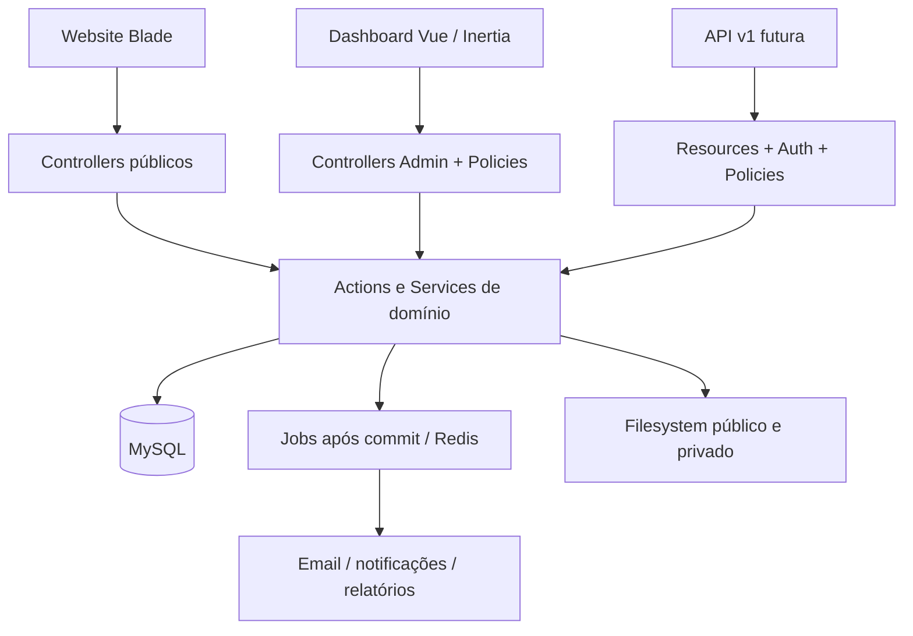

# CUGUFLS / FAMÍLIA GUNDJA — Blueprint técnico v1

Data: 24/09/2026. Estado: especificação para implementação por fases.

## Objetivo e entrega

Uma plataforma central para presença institucional, catálogo, inventário e pedidos dos segmentos Farmácia, Comercial, Timbragem e Lubrificantes. Farmácia tem prioridade na homepage; Luanda e Bailundo são localizações, não segmentos.

Este diretório contém documentação e código PHP de referência. Não instala funcionalidades, não modifica rotas da aplicação e não executa migrations na base existente. O código de referência será integrado na fase correspondente, juntamente com Policies, validação e testes. Nenhum número, contacto, preço ou endereço ilustrativo é dado de produção.

| Documento | Conteúdo |
|---|---|
| [Dados e ERD](01-dados.md) | Dicionário, integridade, diagramas e política de retenção |
| [Domínio e Models](02-dominio.md) | Relacionamentos, operações e regras transacionais |
| [Rotas e telas](03-rotas-telas.md) | Website, autenticação, administração e wireframes |
| [Permissões](04-permissoes.md) | Matriz de perfis e escopo por segmento/filial |
| [API](05-api.md) | Endpoints, campos, filtros, erros e idempotência |
| [Implementação](06-implementacao.md) | Fases, critérios de aceite, segurança e operação |
| [Referências PHP](reference/) | Migrations ordenadas e Models de domínio; integração posterior |

## Decisões de arquitetura

- Monólito modular Laravel. Um banco de dados, um domínio e uma implantação; separação lógica por módulos.
- Backend existente: `composer.json` declara Laravel `^13.17` e PHP `^8.3`. Atualmente só há a base inicial, User e migrations de infraestrutura. Vue, Inertia, Fortify, Spatie e Redis ainda precisam de integração e validação de compatibilidade.
- Público: Blade + Tailwind com HTML renderizado no servidor; Vue apenas quando houver interação necessária. Dashboard: Vue 3 + Inertia + Tailwind. Esta escolha preserva o site público simples e mantém uma aplicação administrativa dinâmica.
- MySQL como alvo inicial; MariaDB é alternativa que exige executar a mesma suite de integração. SQLite serve para verificação estrutural, não para validar concorrência de produção.
- Redis para filas/cache em produção. A aplicação local pode usar os drivers database durante a fundação. Jobs são emitidos após commit.
- URLs em português; classes, tabelas, permissões e valores persistidos em inglês. Interface em português, moeda AOA, datas exibidas em Africa/Luanda; armazenamento em UTC.
- Dinheiro em `decimal(15,2)`; quantidades em `decimal(15,3)` para permitir lubrificantes a granel. Produtos vendidos por unidade exigem quantidade inteira. Nunca usar float para cálculo monetário.
- Catálogo central. Um produto pertence a um segmento e uma categoria; uma filial pode operar vários segmentos através de `branch_segment`.
- Pedidos são consultas/reservas comerciais. Criar pedido ou abrir WhatsApp não comprova envio da mensagem, pagamento, venda ou reserva física.
- Vendas, faturação, pagamento online, reservas automáticas, lotes e validade são evoluções com migrations próprias. O inventário v1 é por produto/filial, insuficiente para gestão farmacêutica por lote/validade; incluir essa evolução antes de substituir o controlo operacional que dela dependa.
- A API pública é desenhada agora e implementada na fase 08; os casos de uso serão partilhados com os controllers web.

## Limites desta versão

O sistema não assume aprovação legal para publicidade ou comercialização de medicamentos. Antes da publicação, a empresa deve validar as regras aplicáveis em Angola e configurar a exposição dos produtos. Não se presume disponibilidade dos domínios sugeridos. Contactos, localização, identidade visual, textos e horários precisam de dados reais antes do lançamento.

## Base técnica consultada

As migrations usam `up/down`, chaves estrangeiras e índices do Schema Builder conforme a [documentação de migrations Laravel](https://laravel.com/docs/13.x/migrations). Os Models usam as relações do [Eloquent](https://laravel.com/docs/13.x/eloquent-relationships). A autorização por operação segue o mecanismo de [Policies e Gates](https://laravel.com/docs/13.x/authorization). As regras de concorrência do projeto usam transações e [bloqueio pessimista](https://laravel.com/docs/13.x/queries#pessimistic-locking). A escolha da autenticação deve ser integrada ao [starter kit](https://laravel.com/docs/13.x/starter-kits) compatível com as dependências efetivamente instaladas. As regras de negócio deste blueprint são decisões do projeto.
